## Hi there 👋

<!--
**JINGERHERE/JINGERHERE** is a ✨ _special_ ✨ repository because its `README.md` (this file) appears on your GitHub profile.

Here are some ideas to get you started:

- 🔭 I’m currently working on ...
- 🌱 I’m currently learning ...
- 👯 I’m looking to collaborate on ...
- 🤔 I’m looking for help with ...
- 💬 Ask me about ...
- 📫 How to reach me: ...
- 😄 Pronouns: ...
- ⚡ Fun fact: ...
-->

<!-- metrics: Most used languages | Calendar -->
 

<!--START_SECTION:waka-->


**🐱 My GitHub Data** 

> 📦 2.5 MB Used in GitHub's Storage 
 > 
> 🏆 275 Contributions in the Year 2026
 > 
> 🚫 Not Opted to Hire
 > 
> 📜 9 Public Repositories 
 > 
> 🔑 17 Private Repositories 
 > 
**I'm a Night 🦉** 

```text
🌞 Morning                45 commits          █░░░░░░░░░░░░░░░░░░░░░░░░   05.28 % 
🌆 Daytime                232 commits         ███████░░░░░░░░░░░░░░░░░░   27.20 % 
🌃 Evening                442 commits         █████████████░░░░░░░░░░░░   51.82 % 
🌙 Night                  134 commits         ████░░░░░░░░░░░░░░░░░░░░░   15.71 % 
```
📅 **I'm Most Productive on Friday** 

```text
Monday                   118 commits         ███░░░░░░░░░░░░░░░░░░░░░░   13.83 % 
Tuesday                  77 commits          ██░░░░░░░░░░░░░░░░░░░░░░░   09.03 % 
Wednesday                94 commits          ███░░░░░░░░░░░░░░░░░░░░░░   11.02 % 
Thursday                 141 commits         ████░░░░░░░░░░░░░░░░░░░░░   16.53 % 
Friday                   200 commits         ██████░░░░░░░░░░░░░░░░░░░   23.45 % 
Saturday                 126 commits         ████░░░░░░░░░░░░░░░░░░░░░   14.77 % 
Sunday                   97 commits          ███░░░░░░░░░░░░░░░░░░░░░░   11.37 % 
```


📊 **This Week I Spent My Time On** 

```text
🕑︎ Time Zone: Asia/Shanghai

💬 Programming Languages: 
No Activity Tracked This Week

🔥 Editors: 
No Activity Tracked This Week

🐱‍💻 Projects: 
No Activity Tracked This Week

💻 Operating System: 
No Activity Tracked This Week
```

**I Mostly Code in C++** 

```text
C++                      4 repos             █████░░░░░░░░░░░░░░░░░░░░   20.00 % 
Python                   4 repos             █████░░░░░░░░░░░░░░░░░░░░   20.00 % 
Jupyter Notebook         3 repos             ████░░░░░░░░░░░░░░░░░░░░░   15.00 % 
C                        1 repo              █░░░░░░░░░░░░░░░░░░░░░░░░   05.00 % 
HTML                     1 repo              █░░░░░░░░░░░░░░░░░░░░░░░░   05.00 % 
```


**Timeline**


 Last Updated on 17/07/2026 15:44:38 UTC
<!--END_SECTION:waka-->

<!-- Snake animation -->
<picture>
  <source media="(prefers-color-scheme: dark)" srcset="./assets/snake/github-contribution-grid-snake-dark.svg">
  <source media="(prefers-color-scheme: light)" srcset="./assets/snake/github-contribution-grid-snake.svg">
  
</picture>